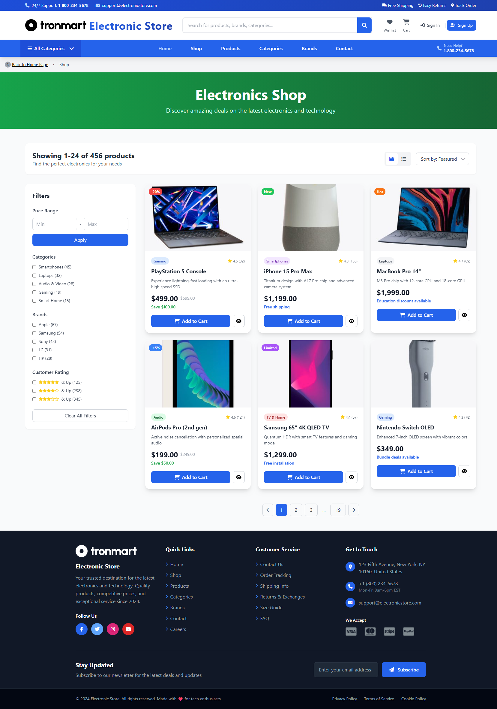
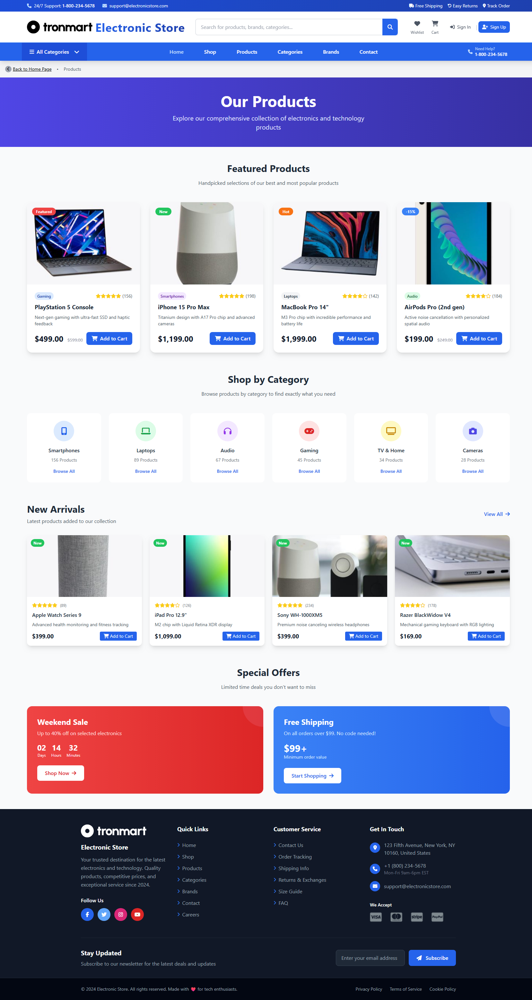
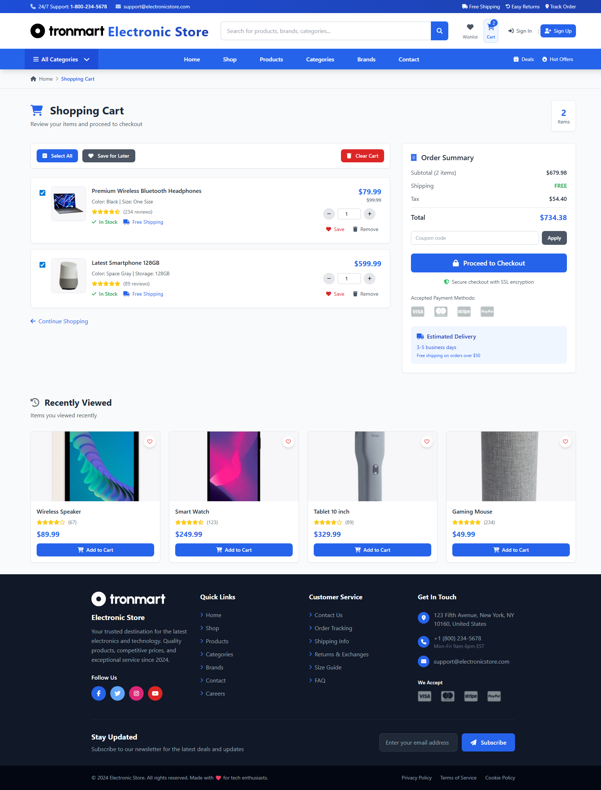
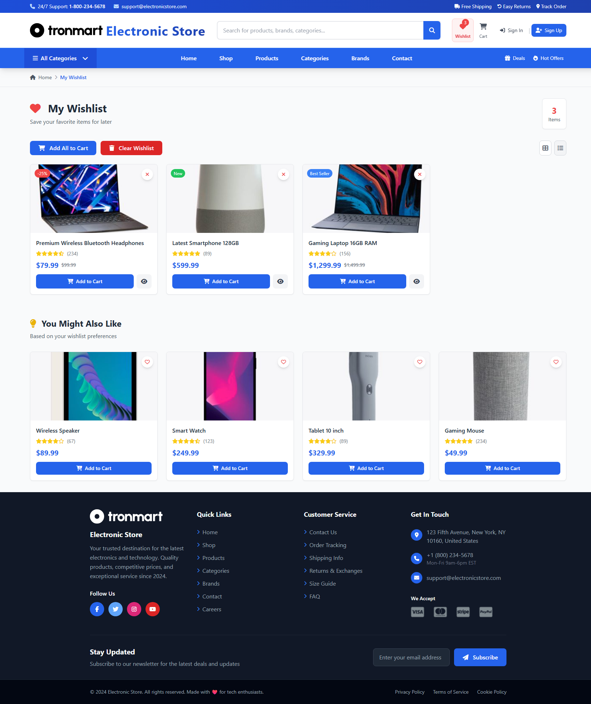
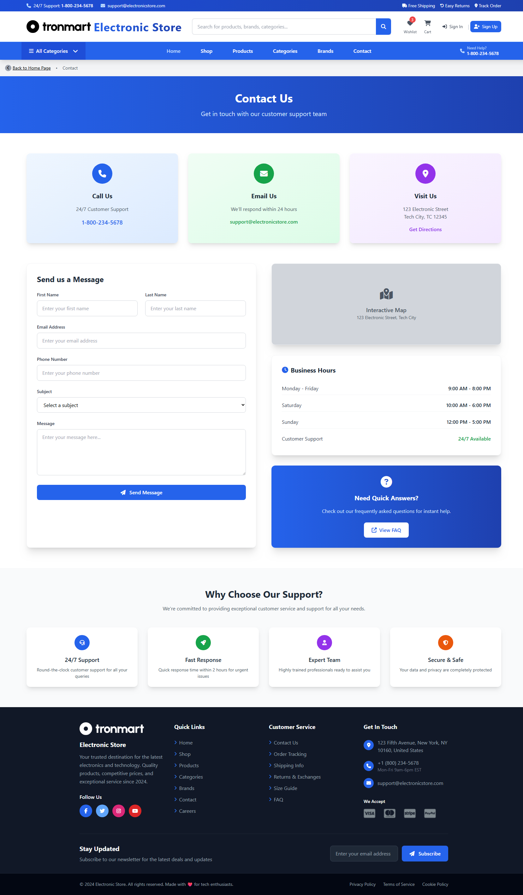

# Ecommerce Template

A modern, responsive HTML5 ecommerce website template built with Tailwind CSS and JavaScript. Perfect for electronics stores and online retail businesses.

**Design UI/UX Credits:** websitedemos.net | Electronic Store

## 📋 Table of Contents

- [Features](#-features)
- [Screenshots](#-screenshots)
- [Project Structure](#-project-structure)
- [Getting Started](#️-getting-started)
- [Customization](#-customization)
- [Pages Included](#-pages-included)
- [Development Scripts](#-development-scripts)
- [Demo](#-demo)
- [Browser Support](#-browser-support)
- [Contributing](#-contributing)
- [License](#-license)
- [Support](#-support)

## 🚀 Features

### 🎨 Design & User Experience
- ✅ **Fully Responsive Design** - Works seamlessly on desktop, tablet, and mobile devices
- ✅ **Modern UI/UX** - Clean, professional design with smooth animations and transitions
- ✅ **Mobile-First Approach** - Optimized for mobile devices with touch-friendly interactions
- ✅ **Accessible Design** - Built with accessibility best practices in mind

### 🛠️ Technical Features
- ✅ **Tailwind CSS** - Utility-first CSS framework for rapid development and customization
- ✅ **Vanilla JavaScript** - No heavy frameworks, pure JavaScript for better performance
- ✅ **Flexbox & Grid Layouts** - Modern CSS layout techniques for flexible designs
- ✅ **Performance Optimized** - Fast loading times and smooth user experience
- ✅ **Cross-browser Compatible** - Works on all modern browsers (Chrome, Firefox, Safari, Edge)
- ✅ **SEO Friendly** - Semantic HTML structure for better search engine optimization

### 🛍️ Ecommerce Features
- ✅ **Product Catalog** - Comprehensive product listing with categories and filters
- ✅ **Product Detail Pages** - Detailed product views with image galleries and specifications
- ✅ **Shopping Cart** - Add to cart functionality with quantity management
- ✅ **Wishlist** - Save favorite products for later purchase
- ✅ **User Authentication** - Sign in and sign up pages with form validation
- ✅ **Order Tracking** - Real-time order status and delivery tracking
- ✅ **Brand Showcase** - Dedicated pages for featured brands and manufacturers
- ✅ **Contact & Support** - Customer service and contact forms

## 📂 Project Structure

```
├── 📄 index.html              # Main homepage - Landing page with hero section
├── 📄 productPage.html         # Product detail page - Individual product view
├── 📄 shop.html               # Shop page - Product grid with filters
├── 📄 products.html           # Products listing - Featured products showcase
├── 📄 categories.html         # Categories page - Browse by product categories
├── 📄 brands.html             # Brands page - Featured brands and manufacturers
├── 📄 contact.html            # Contact page - Customer support and contact form
├── 📄 cart.html               # Shopping cart - Cart management and checkout
├── 📄 wishlist.html           # Wishlist page - Saved favorite products
├── 📄 signin.html             # Sign in page - User authentication
├── 📄 signup.html             # Sign up page - User registration
├── 📄 track-order.html        # Order tracking - Real-time delivery status
├── 📄 package.json            # Dependencies and build scripts
├── 📄 tailwind.config.js      # Tailwind CSS configuration
├── 📂 assests/                # Main assets directory
│   ├── 📂 css/
│   │   ├── 📄 input.css       # Tailwind source file with custom styles
│   │   └── 📄 style.css       # Compiled CSS ready for production
│   ├── 📂 img/                # Images, product photos, and graphics
│   │   ├── 🖼️ Product images   # Product catalog photos (300x300)
│   │   ├── 🖼️ Category images  # Category showcase images
│   │   ├── 🖼️ Brand logos      # Brand and company logos
│   │   ├── 🖼️ Hero banners     # Homepage hero and promotional banners
│   │   └── 🖼️ UI elements      # Icons, avatars, and interface elements
│   └── 📂 js/
│       └── 📄 main.js         # JavaScript functionality and interactions
├── 📂 screenshots/            # Template preview screenshots
│   ├── 🖼️ Home.png            # Homepage preview
│   ├── 🖼️ ProductPage.png     # Product page preview
│   ├── 🖼️ Shop.png            # Shop page preview
│   └── 🖼️ ...other pages      # Additional page previews
└── 📄 README.md              # Project documentation
```

## 🛠️ Getting Started

### Prerequisites

- Node.js (v14 or higher)
- npm or yarn package manager

### Installation

1. **Clone the repository**
   ```bash
   git clone <repository-url>
   cd Ecommerce-Template-Tailwind
   ```

2. **Install dependencies**
   ```bash
   npm install
   ```

3. **Start development server**
   ```bash
   npm run dev
   ```
   This will start a local development server and open the template in your default browser.

4. **Build for production**
   ```bash
   npm run build
   ```
   This will compile and minify all assets for production deployment.

### Quick Start (No Build Process)

If you want to use the template without a build process:

1. Download or clone the repository
2. Open `index.html` directly in your web browser
3. All styles are already compiled in `assests/css/style.css`

## 🌐 Browser Support

This template supports all modern browsers:

| Browser | Version |
|---------|---------|
| Chrome  | 60+     |
| Firefox | 60+     |
| Safari  | 12+     |
| Edge    | 79+     |

## 🎨 Customization

### Tailwind CSS
- Modify `tailwind.config.js` to customize colors, fonts, spacing, and breakpoints
- Edit `assests/css/input.css` for custom styles and component classes
- Run `npm run build-css` to compile changes and update the production CSS

### Images & Assets
- Replace images in `assests/img/` with your own product images and branding
- Maintain consistent image dimensions (300x300px for product images)
- Update image paths in HTML files accordingly
- Optimize images for web to maintain fast loading times

### Content & Branding
- Edit `index.html` for homepage content, hero section, and featured products
- Modify `productPage.html` for product details, specifications, and pricing
- Update JavaScript in `assests/js/main.js` for custom functionality and interactions
- Customize colors and fonts in `tailwind.config.js` to match your brand

### Configuration Files
- **`package.json`** - Update project information, dependencies, and build scripts
- **`tailwind.config.js`** - Customize Tailwind theme, colors, fonts, and utilities

## 📱 Pages Included

### 🏠 **Homepage (`index.html`)**
Complete ecommerce landing page featuring:
- **Hero Section** - Eye-catching banner with call-to-action
- **Product Categories** - Browse products by category with visual cards
- **Featured Products** - Highlighted bestsellers and new arrivals
- **Promotional Banners** - Special offers and seasonal promotions
- **Customer Reviews** - Social proof with customer testimonials
- **Newsletter Signup** - Email collection for marketing
- **Footer** - Site navigation, contact info, and payment methods

### 🛍️ **Product Page (`productPage.html`)**
Detailed product view including:
- **Product Image Gallery** - Multiple product photos with zoom functionality
- **Product Information** - Detailed descriptions, specifications, and features
- **Pricing & Variants** - Price display with size/color options
- **Add to Cart** - Quantity selection and cart functionality
- **Product Reviews** - Customer ratings and review system
- **Related Products** - Cross-selling with similar items
- **Shipping Information** - Delivery options and timing

### 🛒 **Shop Page (`shop.html`)**
Comprehensive shopping experience with:
- **Product Grid Layout** - Responsive grid of product cards
- **Advanced Filters** - Filter by price, brand, category, and ratings
- **Sorting Options** - Sort by price, popularity, and newest
- **Pagination** - Navigate through large product catalogs
- **Category Sidebar** - Quick category navigation
- **Search Functionality** - Find specific products quickly

### 📦 **Products Page (`products.html`)**
Featured products showcase featuring:
- **Product Categories** - Organized product sections
- **New Arrivals** - Latest additions to catalog
- **Special Offers** - Discounted and promotional items
- **Product Recommendations** - AI-driven suggestions
- **Bestsellers** - Top-selling products highlighting

### 📂 **Categories Page (`categories.html`)**
Browse by categories with:
- **Category Grid Display** - Visual category browsing
- **Featured Categories** - Highlighted product categories
- **Product Count** - Number of products per category
- **Modern Card Layouts** - Clean, organized category presentation
- **Quick Navigation** - Easy category switching

### 🏢 **Brands Page (`brands.html`)**
Brand showcase including:
- **Brand Logos** - Official brand imagery and information
- **Featured Brands** - Highlighted manufacturer partnerships
- **Brand Categories** - Organize brands by product type
- **Professional Layouts** - Clean brand presentation
- **Brand Stories** - Company information and heritage

### 🛒 **Shopping Cart (`cart.html`)**
Complete cart management with:
- **Item Management** - Add, remove, and update quantities
- **Price Calculation** - Subtotal, taxes, and shipping costs
- **Coupon Codes** - Discount code application
- **Checkout Process** - Streamlined purchase flow
- **Save for Later** - Move items to wishlist

### ❤️ **Wishlist (`wishlist.html`)**
Save favorite products featuring:
- **Product Saving** - Add products for later purchase
- **Quick Actions** - Move to cart or remove items
- **Share Wishlist** - Social sharing functionality
- **Priority Sorting** - Organize saved items

### 🔐 **User Authentication**
- **Sign In (`signin.html`)** - User login with form validation
- **Sign Up (`signup.html`)** - User registration with email verification

### 📞 **Contact Page (`contact.html`)**
Customer support and contact featuring:
- **Contact Form** - Multi-purpose inquiry form with validation
- **Business Information** - Address, phone, email, and hours
- **Interactive Map** - Location display with directions
- **Support Features** - FAQ, live chat, and help resources
- **Social Media** - Links to company social profiles

### 📋 **Track Order Page (`track-order.html`)**
Order tracking functionality including:
- **Order Number Lookup** - Search orders by confirmation number
- **Real-time Tracking** - Live delivery status updates
- **Timeline Display** - Visual tracking progress
- **Delivery Details** - Estimated delivery time and carrier information
- **Order History** - Past purchase tracking

## 🔧 Development Scripts

```bash
npm run dev          # Start development server
npm run build        # Build for production
npm run build-css    # Compile Tailwind CSS
npm run watch        # Watch for changes
```

## 📸 Screenshots

### Homepage

*Modern and responsive homepage with hero section, featured products, and promotional banners*

### Product Page

*Detailed product view with gallery, specifications, and add to cart functionality*

### Shop Page

*Product listing with filters, sorting options, and grid layout*

### Products Page

*Featured products showcase with categories and recommendations*

### Categories

*Browse products by categories with modern card layouts*

### Brands

*Brand showcase with professional layouts and featured brands*

### Shopping Cart

*Shopping cart with item management and checkout process*

### Wishlist

*Save favorite products for later purchase*

### User Authentication

*User login page with modern design*


*User registration with form validation*

### Contact & Support

*Contact page with form, business information, and support features*

### Order Tracking

*Real-time order tracking with delivery status updates*

## 🌟 Demo

### 🔗 Live Demo
**[View Live Demo](https://abdelghanix10.github.io/Ecommerce-Template-Tailwind/)**

Experience the full template functionality with the live demo hosted on GitHub Pages.

### 💻 Local Development
Open `index.html` in your browser to see the template in action, or set up a local development server for the best experience.

## 📄 License

This project is open source and available under the [MIT License](LICENSE).

## 🤝 Contributing

Contributions, issues, and feature requests are welcome! Feel free to check the issues page.

## 📞 Support

For support and questions, please open an issue in the repository.

---

**Made with ❤️ using Tailwind CSS**
